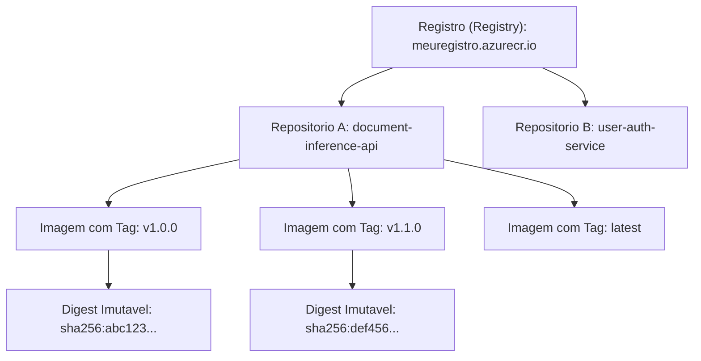

# Conceitos do Azure Container Registry (ACR) e Estrutura de Imagens

Data de Estudo: 22 de setembro de 2026  
Referencia oficial: [Microsoft Learn - Store and manage container images with Azure Container Registry](https://learn.microsoft.com/pt-br/training/modules/store-manage-containers-azure-container-registry/2-image-storage?pivots=text)

---

## 1. O Modelo Mental do ACR: O "GitHub" das Imagens

O **Azure Container Registry (ACR)** funciona como um registro privado e gerenciado para armazenar e gerenciar imagens de contêiner Docker/OCI e artefatos relacionados.

### O paralelo direto com o desenvolvimento C#/.NET:

| Conceito de Conteiner (ACR) | Conceito .NET (NuGet) | Exemplo Pratico |
| :--- | :--- | :--- |
| **Registro (Registry)** | Servidor de Feed do NuGet (ex: NuGet.org ou Azure Artifacts) | `meuregistro.azurecr.io` |
| **Repositorio (Repository / Colecao)** | Nome do Pacote (ID) | `document-inference-api` |
| **Tag (Versao)** | Versao do Pacote | `:v1.0.0` ou `:latest` |
| **Digest** | Hash SHA-256 exato do binario `.nupkg` | `sha256:8f4893bc...` |

---

## 2. Estrutura Hierarquica do Registro

A estrutura organizacional dentro do ACR e definida assim:

### Componentes chave:

* **Registry (Registro):** Criado na sua assinatura do Azure. Gerencia o acesso (Azure RBAC / Entra ID), politicas de rede e geo-replicacao.
* **Repository (Repositorio):** Uma colecao de imagens com o mesmo nome, mas tags diferentes. Facilita a organizacao por microservico ou modulo da solucao de IA.
  * **Uso de Namespaces:** O ACR suporta nomes de repositorios estruturados com barras (ex: `ia/document-inference-api` ou `dev/ia/classifier`), o que funciona como um sistema de pastas (namespaces) para agrupar e gerenciar permissões em coleções de contêineres correlacionados de forma organizada.
* **Tag:** Um ponteiro legivel por humanos para identificar versoes. Como tags sao mutaveis (podem ser sobrescritas), usar `:latest` em producao e um risco de seguranca e estabilidade.
* **Digest (SHA-256):** O identificador unico gerado pelo conteudo fisico da imagem. Ele e **totalmente imutavel**. Garantia maxima de reprodutibilidade em producao.

---

## 3. Armazenamento e Recursos do ACR para a Prova AI-200

* **Suporte a OCI (Open Container Initiative):** Alem de imagens Docker, o ACR suporta artefatos OCI, como Helm Charts e arquivos de especificacao Open API.
* **Niveis de Servico (Tiers / SKUs):**
  * **Basic:** Ideal para desenvolvimento/testes locais.
  * **Standard:** Bom para cenarios de producao iniciais.
  * **Premium:** Essencial para grandes empresas, fornecendo **Geo-replicacao** (distribui copias locais do ACR pelo mundo proximo aos seus clusters de deploy) e suporte a links privados (Azure Private Link).
